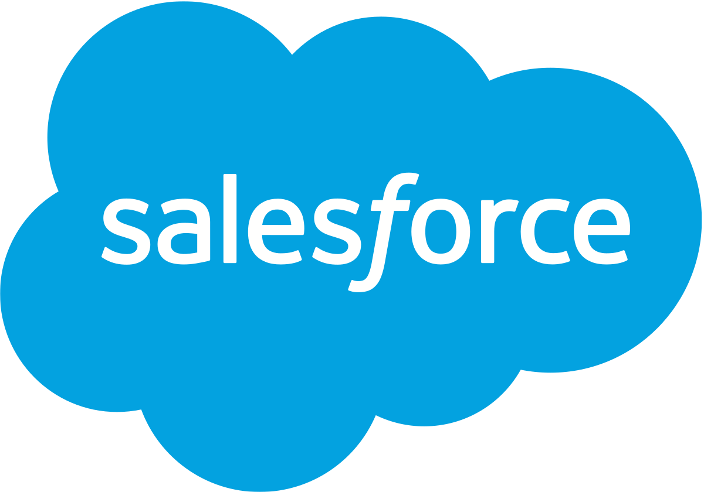

<h1 align="center" id="id_ultimate_salesforce">The Ultimate Salesforce Interview Handbook</h1>

    
      
    <em>Subscribe to my Youtube channel <a href="https://www.youtube.com/user/seyitbek"> Salesforce Chef</a> </em>
  

## What is this?

Unlike typical software engineer job interviews, Salesforce interviews have no emphasis on algorithms and have more questions on Salesforce fundamental knowledge and expertise about the domain — i.e. Apex, Process Builders, Lightning Web Components.

While there are some existing resources to help Salesforce admins and developers in preparing for interviews, they are dispersed and incomplete.

## Looking for Salesforce Interview Preparation?
Right here in front of you is the **ultimate** Salesforce interview toolkit. The authors have studied all the existing resources online to ensure it has the best questions of all. Furthermore, this resource is getting continually updated by developers.

## Table of Contents

* **Admins**
  * [Functional Questions](/admin/admin-technical-questions.md)
  * [Scenario Questions](/admin/admin-scenario-questions.md)
  * [Knowledge Checklist](/admin/admin-knowledge-checklist.md)

* **Developers**
  * [Functional Questions](/dev/developer-questions.md)
  * [Scenario Questions] (/dev/scenario-questions.md)
  * [Knowledge Checklist] (/dev/knowledge-checklist.md)
  * <a href="https://github.com/usmanovs/Salesforce-Interview-Handbook/blob/master/dev-exercises.md">Salesforce Exercises</a>
  
* **Confessions of Recruiters**
  * [Current IT Recruiter- Alex Karmazin](/questions/Alex.md)
  * [Current Salesforce Recruiter- Chris Hopper](/questions/ChrisH.md)
  * [Former IT Recruiter- Chris Johannes](/questions/Chris.md)
  

### Submitting New Questions

These questions have been curated by a team of salesforce professionals. If you are keen to add a question/answer, submit an issue/pull request to the [original questions repository](https://github.com/usmanovs/sf-interview-handbook).

### Answering Questions

You are welcome to make improvements to existing answers and answer unanswered questions. Whenever possible, add a list of references and supplementary material. This would be helpful for readers who would like to go further in-depth into the answer.

The project is currently maintained by:

- [@usmanovs](https://github.com/usmanovs)
- [@rohit daswani](https://github.com/rohit-daswani)

### Supporting

Thousands of hours of hard work have gone into this project. Your support will be much appreciated and give us strength to keep improving it!

